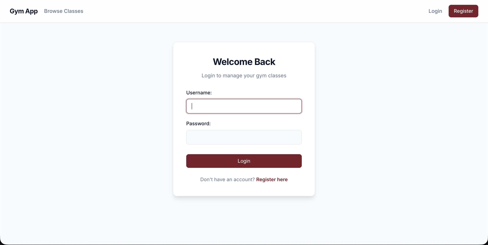
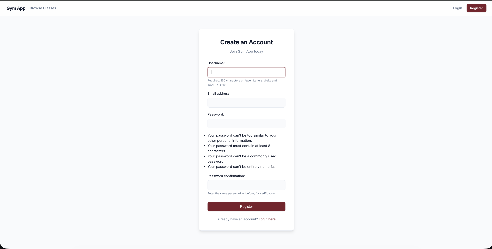
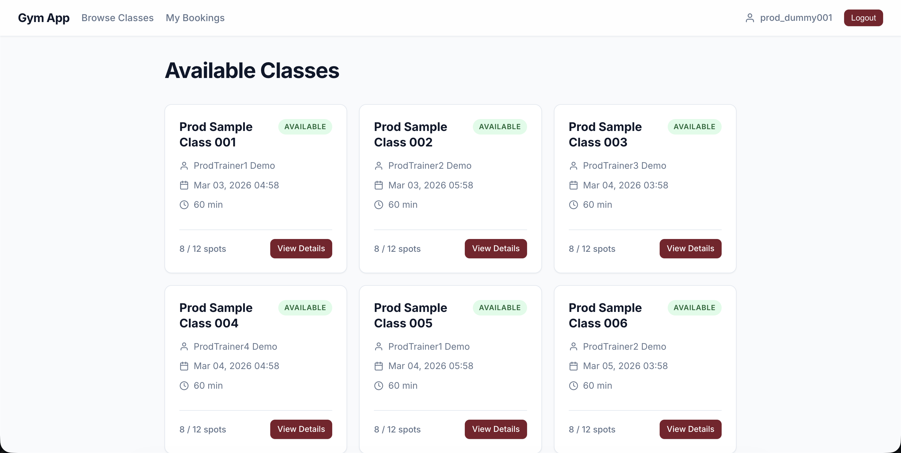
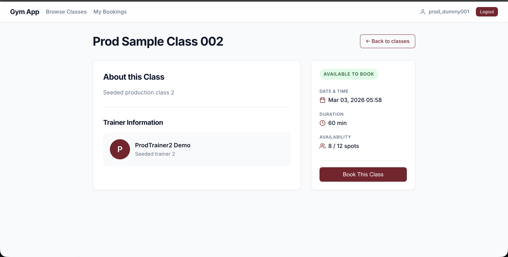
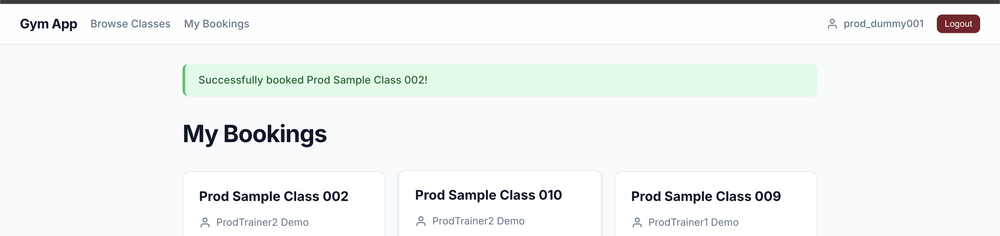
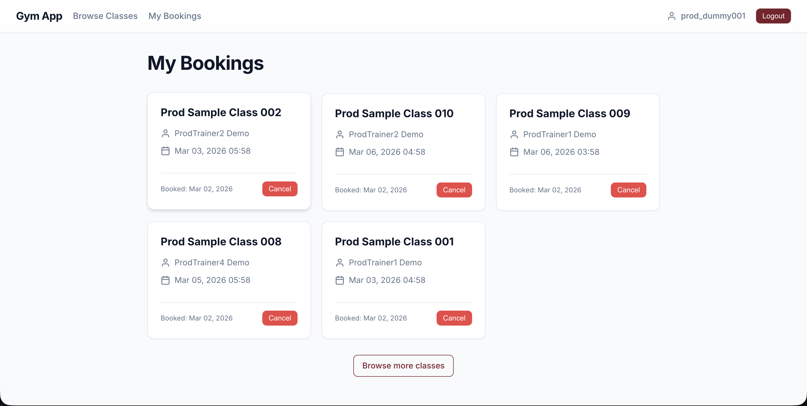
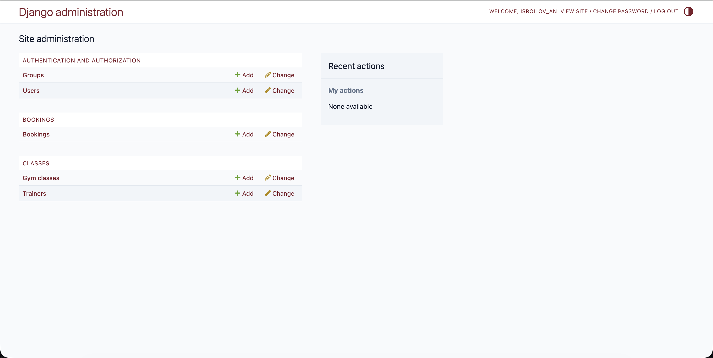
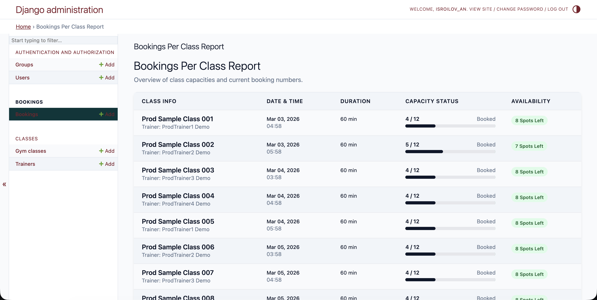
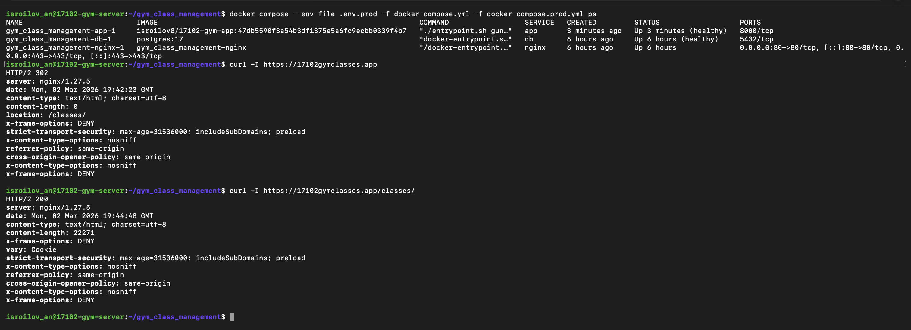

# Gym Class Management

A full-stack web application for managing gym classes, trainers, and member bookings.
Built with Django, PostgreSQL, and Nginx — containerised with Docker and deployed via a fully automated CI/CD pipeline.

**Live:** [https://17102gymclasses.app](https://17102gymclasses.app)

---

## Table of Contents

- [Features](#features)
- [Tech Stack](#tech-stack)
- [Database Schema](#database-schema)
- [Project Structure](#project-structure)
- [Local Development Setup](#local-development-setup)
- [Production Deployment](#production-deployment)
- [Environment Variables](#environment-variables)
- [CI/CD Pipeline](#cicd-pipeline)
- [Screenshots](#screenshots)
- [Test Credentials](#test-credentials)
- [Live Links](#live-links)

---

## Features

- **User Authentication** — register, log in, and log out
- **Class Browsing** — view all upcoming gym classes with availability indicators
- **Class Details** — see trainer info, schedule, duration, and remaining spots
- **Booking System** — book and cancel classes with real-time capacity enforcement; duplicate bookings, past-class bookings, and fully booked classes are rejected
- **My Bookings** — personalised dashboard of all current bookings
- **Admin Panel** — full CRUD management for trainers, classes, and bookings
- **Static & Media Files** — served via Nginx with caching headers in production

---

## Tech Stack

| Layer | Technology |
|---|---|
| Backend | Django 6.0 · Python 3.13 |
| WSGI Server | Gunicorn 23 |
| Database | PostgreSQL 17 |
| Reverse Proxy | Nginx (TLS termination · HTTP/2) |
| Containerisation | Docker (multi-stage Alpine build) · Docker Compose |
| CI/CD | GitHub Actions → Docker Hub → SSH deploy |
| SSL/TLS | Let's Encrypt (Certbot) |
| Testing | pytest · pytest-django · pytest-cov |
| Linting | flake8 |

---

## Database Schema

The application uses **3 models** with the following relationships:

```
┌──────────┐       ┌──────────────┐       ┌──────────┐
│  Trainer  │──1:N──│   GymClass   │──M:N──│   User   │
└──────────┘       └──────────────┘       └──────────┘
                          │                     │
                          └────── Booking ──────┘
                              (join model)
```

- **Trainer** — gym trainers (name, bio, specialisation, photo)
- **GymClass** — scheduled sessions (name, description, schedule, duration, capacity)
  - *Many-to-one*: each class has one trainer (`ForeignKey → Trainer`)
  - *Many-to-many*: members ↔ classes via the `Booking` through-model
- **Booking** — member reservations (unique per member + class, with validation rules)

---

## Project Structure

```
├── .github/workflows/
│   └── deploy.yml              # CI/CD pipeline (lint → test → build → deploy)
├── config/
│   ├── settings.py             # Django settings (env-driven)
│   ├── urls.py                 # Root URL configuration
│   ├── wsgi.py                 # WSGI entry point
│   └── asgi.py                 # ASGI entry point
├── src/
│   ├── classes/                # GymClass & Trainer models, views, templates
│   └── bookings/               # Booking model, views, forms, templates
├── templates/
│   ├── base.html               # Site-wide base template
│   └── registration/           # Login & register templates
├── static/                     # Source static assets (CSS, JS, images)
├── nginx/
│   ├── Dockerfile              # Nginx container image
│   └── default.conf            # Reverse proxy + TLS + static file serving
├── scripts/
│   ├── init-letsencrypt.sh     # Initial SSL certificate provisioning
│   └── renew-cert.sh           # Certificate renewal
├── tests/                      # pytest test suite
├── Dockerfile                  # Multi-stage app image (builder → runtime)
├── docker-compose.yml          # Base service definitions (app, db)
├── compose.dev.yml             # Dev overrides (runserver, bind-mount)
├── docker-compose.prod.yml     # Prod overrides (gunicorn, nginx, restart)
├── gunicorn.conf.py            # Gunicorn worker/timeout settings
├── entrypoint.sh               # Migrations + collectstatic on startup
├── requirements/
│   ├── base.txt                # Runtime dependencies
│   └── dev.txt                 # Dev/test dependencies (pytest, flake8)
├── .env.dev.example            # Dev environment template
└── .env.prod.example           # Prod environment template
```

---

## Local Development Setup

### Prerequisites

- **Docker** and **Docker Compose** installed
- **Git**

### Steps

1. **Clone the repository**

   ```bash
   git clone https://github.com/IsroilovA/gym_class_management.git
   cd gym_class_management
   ```

2. **Create environment file**

   ```bash
   cp .env.dev.example .env.dev
   ```

   Edit `.env.dev` if needed — the supplied defaults are ready to use without changes.

3. **Start the development stack**

   ```bash
   docker compose -f docker-compose.yml -f compose.dev.yml up --build
   ```

4. **Create a superuser** (in a separate terminal)

   ```bash
   docker compose -f docker-compose.yml -f compose.dev.yml exec app python manage.py createsuperuser
   ```

5. **Access the application**

   - App: [http://localhost:8000](http://localhost:8000)
   - Admin: [http://localhost:8000/admin/](http://localhost:8000/admin/)

6. **Stop the development stack**

   ```bash
   docker compose -f docker-compose.yml -f compose.dev.yml down
   ```

---

## Production Deployment

### Prerequisites

- A Linux server with Docker and Docker Compose
- A domain name pointed to the server IP
- UFW firewall configured (ports 22, 80, 443)

### How It Works

The app image is **built and pushed to Docker Hub automatically** by the CI/CD pipeline on every push to `main`. The production server never builds the image locally — it only pulls the pre-built image.

### Server Setup

The server only needs the configuration files (not the full source code):

1. **Copy the required files to the server**

   ```
   ~/gym_class_management/
   ├── docker-compose.yml
   ├── docker-compose.prod.yml
   ├── nginx/
   │   ├── Dockerfile
   │   └── default.conf
   ├── scripts/
   │   ├── init-letsencrypt.sh
   │   └── renew-cert.sh
   └── .env.prod
   ```

2. **Configure environment**

   ```bash
   cp .env.prod.example .env.prod
   ```

   Fill in `.env.prod` with production values:
   - Generate a strong `SECRET_KEY`
   - Set real database credentials
   - Set `ALLOWED_HOSTS` to your domain and server IP
   - Set `CERTBOT_EMAIL` and `CERTBOT_DOMAINS`
   - Set `APP_IMAGE` (e.g. `isroilov8/17102-gym-app:latest`)

3. **Provision SSL certificates**

   ```bash
   chmod +x scripts/init-letsencrypt.sh
   ./scripts/init-letsencrypt.sh
   ```

4. **Start the production stack**

   ```bash
   docker compose --env-file .env.prod \
     -f docker-compose.yml -f docker-compose.prod.yml \
     up -d
   ```

   The app image is pulled from Docker Hub; only the Nginx image is built locally.

5. **Verify deployment**

   ```bash
   docker compose --env-file .env.prod \
     -f docker-compose.yml -f docker-compose.prod.yml \
     ps
   ```

   The application should be accessible at `https://<your-domain>`.

> **Note:** After initial setup, all subsequent deployments are handled automatically by the CI/CD pipeline — no manual steps required.

---

## Environment Variables

### Django

| Variable | Description | Dev Default | Prod Example |
|---|---|---|---|
| `ENVIRONMENT` | `development` or `production` | `development` | `production` |
| `SECRET_KEY` | Django secret key | dev placeholder | *generate a strong value* |
| `DEBUG` | Enable debug mode | `True` | `False` |
| `ALLOWED_HOSTS` | Comma-separated hostnames | `localhost,127.0.0.1` | `your-domain.com,your-ip` |

### Database

| Variable | Description | Dev Default | Prod Example |
|---|---|---|---|
| `DB_NAME` | PostgreSQL database name | `local_dev_db_name` | `gym_db_prod` |
| `DB_USER` | PostgreSQL user | `local_dev_db_user` | `gym_user_prod` |
| `DB_PASSWORD` | PostgreSQL password | `local_dev_db_password` | *generate a strong value* |
| `DB_HOST` | Database host | `localhost` | `db` |
| `DB_PORT` | Database port | `5432` | `5432` |

### Certbot / SSL (Production only)

| Variable | Description | Example |
|---|---|---|
| `CERTBOT_EMAIL` | Let's Encrypt registration email | `you@example.com` |
| `CERTBOT_DOMAINS` | Comma-separated domains | `17102gymclasses.app,www.17102gymclasses.app` |
| `CERTBOT_STAGING` | `1` = staging CA, `0` = production CA | `0` |

### Docker / Gunicorn (Production only)

| Variable | Description | Default |
|---|---|---|
| `APP_IMAGE` | Docker image reference | `isroilov8/17102-gym-app:latest` |
| `GUNICORN_MAX_WORKERS` | Maximum worker process cap | `3` |
| `GUNICORN_WORKERS` | Explicit worker count override | auto |
| `GUNICORN_TIMEOUT` | Request timeout (seconds) | `120` |
| `GUNICORN_LOG_LEVEL` | Log verbosity | `info` |

---

## CI/CD Pipeline

The GitHub Actions workflow (`.github/workflows/deploy.yml`) triggers on every **push** and **pull request** to `main`. Lint and test stages run on both events; build and deploy run **only on push**:

| Stage | Job | Description | Trigger |
|---|---|---|---|
| 1 | **Lint** | Runs `flake8` for code quality checks | push & PR |
| 2 | **Test** | Runs `pytest` against a PostgreSQL service container | push & PR |
| 3 | **Docker Build & Push** | Builds the multi-stage image, tags with commit SHA + `latest`, pushes to Docker Hub | push only |
| 4 | **Deploy** | SSHs into the server, pulls the new image, recreates the app container with minimal downtime (db & nginx stay up), runs health checks | push only |

### Required GitHub Secrets

| Secret | Purpose |
|---|---|
| `DOCKERHUB_USERNAME` | Docker Hub login |
| `DOCKERHUB_TOKEN` | Docker Hub access token |
| `SSH_PRIVATE_KEY` | SSH key for server access |
| `SSH_HOST` | Server IP / hostname |
| `SSH_USERNAME` | SSH login user |

---

## Screenshots

### Login Page



### Registration Page



### Classes List



### Class Details



### Booking Confirmation



### My Bookings



### Admin Panel



### Admin Panel — Model Management



### Deployment Proof



---

## Test Credentials

| Role | Username | Password |
|---|---|---|
| Regular User | `prod_dummy001` | `ChangeThisNow123!` |
| Admin | `admin` | `admin123` |

---

## Live Links

| Resource | URL |
|---|---|
| 🌐 Live Application | [https://17102gymclasses.app](https://17102gymclasses.app) |
| 📦 GitHub Repository | [https://github.com/IsroilovA/gym_class_management](https://github.com/IsroilovA/gym_class_management) |
| 🐳 Docker Hub | [https://hub.docker.com/r/isroilov8/17102-gym-app](https://hub.docker.com/r/isroilov8/17102-gym-app) |

